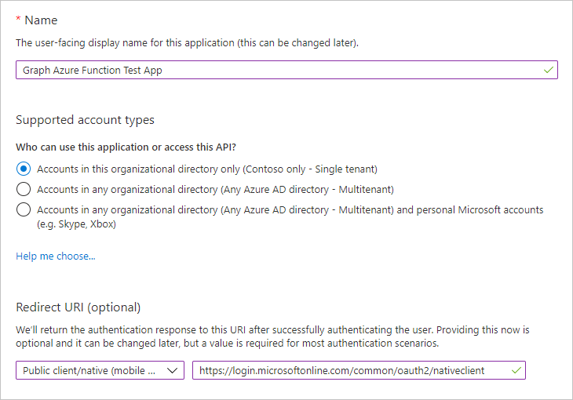
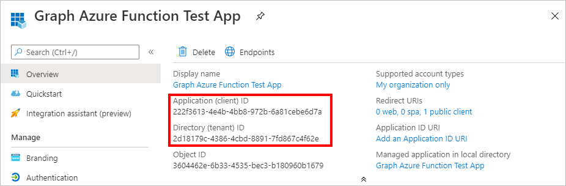
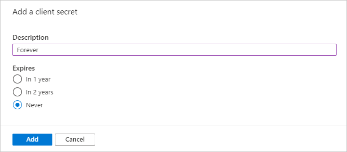
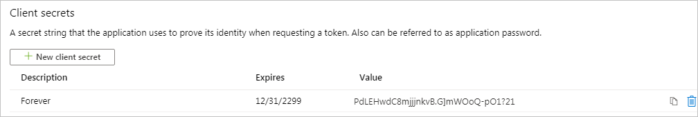
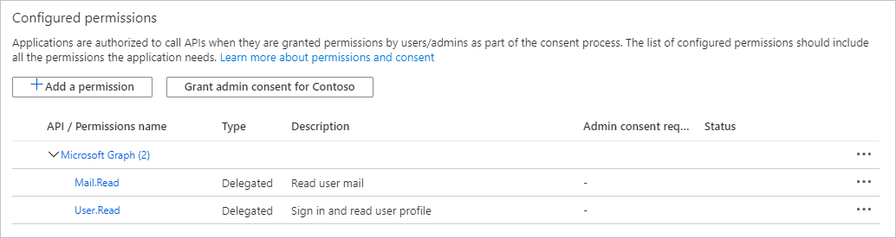
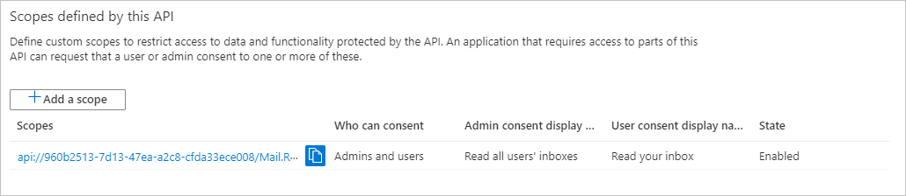
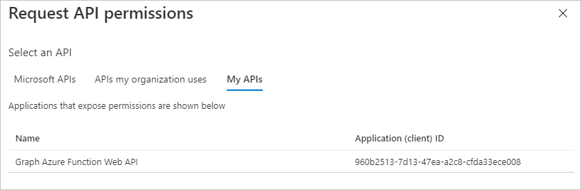
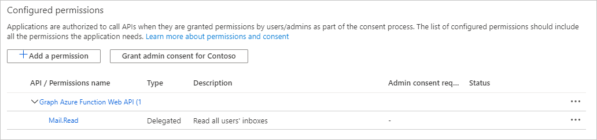
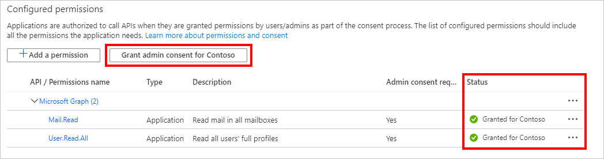

<!-- markdownlint-disable MD002 MD041 -->

In this exercise you will create three new Azure AD applications using the Azure Active Directory admin center:

- An app registration for the single-page application so that it can sign in users and get tokens allowing the application to call the Azure Function.
- An app registration for the Azure Function that allows it to use the [on-behalf-of flow](https://docs.microsoft.com/azure/active-directory/develop/v2-oauth2-on-behalf-of-flow) to exchange the token sent by the SPA for a token that will allow it to call Microsoft Graph.
- An app registration for the Azure Function webhook that allows it to use the [client credential flow](https://docs.microsoft.com/azure/active-directory/develop/v2-oauth2-client-creds-grant-flow) to call Microsoft Graph without a user.

> [!NOTE]
> This example requires three app registrations because it is implementing both the on-behalf-of flow and the client credential flow. If your Azure Function only uses one of these flows, you would only need to create the app registrations that correspond to that flow.

1. Open a browser and navigate to the [Azure Active Directory admin center](https://aad.portal.azure.com) and login using an Microsoft 365 tenant organization admin.

1. Select **Azure Active Directory** in the left-hand navigation, then select **App registrations** under **Manage**.

    

## Register an app for the single-page application

1. Select **New registration**. On the **Register an application** page, set the values as follows.

    - Set **Name** to `Graph Azure Function Test App`.
    - Set **Supported account types** to **Accounts in this organizational directory only**.
    - Under **Redirect URI**, change the dropdown to **Single-page application (SPA)** and set the value to `http://localhost:8080`.

    

1. Select **Register**. On the **Graph Azure Function Test App** page, copy the values of the **Application (client) ID** and **Directory (tenant) ID** and save them, you will need them in the later steps.

    

## Register an app for the Azure Function

1. Return to **App Registrations**, and select **New registration**. On the **Register an application** page, set the values as follows.

    - Set **Name** to `Graph Azure Function`.
    - Set **Supported account types** to **Accounts in this organizational directory only**.
    - Leave **Redirect URI** blank.

1. Select **Register**. On the **Graph Azure Function** page, copy the value of the **Application (client) ID** and save it, you will need it in the next step.

1. Select **Certificates & secrets** under **Manage**. Select the **New client secret** button. Enter a value in **Description** and select one of the options for **Expires** and select **Add**.

    

1. Copy the client secret value before you leave this page. You will need it in the next step.

    > [!IMPORTANT]
    > This client secret is never shown again, so make sure you copy it now.

    

1. Select **API Permissions** under **Manage**. Choose **Add a permission**.

1. Select **Microsoft Graph**, then **Delegated Permissions**. Add **Mail.Read** and select **Add permissions**.

    

1. Select **Expose an API** under **Manage**, then choose **Add a scope**.

1. Accept the default **Application ID URI** and choose **Save and continue**.

1. Fill in the **Add a scope** form as follows:

    - **Scope name:** Mail.Read
    - **Who can consent?:** Admins and users
    - **Admin consent display name:** Read all users' inboxes
    - **Admin consent description:** Allows the app to read all users' inboxes
    - **User consent display name:** Read your inbox
    - **User consent description:** Allows the app to read your inbox
    - **State:** Enabled

1. Select **Add scope**.

1. Copy the new scope, you'll need it in later steps.

    

1. Select **Manifest** under **Manage**.

1. Locate `knownClientApplications` in the manifest, and replace it's current value of `[]` with `[TEST_APP_ID]`, where `TEST_APP_ID` is the application ID of the **Graph Azure Function Test App** app registration. Select **Save**.

> [!NOTE]
> Adding the test application's app ID to the `knownClientApplications` property in the Azure Function's manifest allows the test application to trigger a [combined consent flow](https://docs.microsoft.com/azure/active-directory/develop/v2-oauth2-on-behalf-of-flow#default-and-combined-consent). This is necessary for the on-behalf-of flow to work.

## Add Azure Function scope to test application registration

1. Return to the **Graph Azure Function Test App** registration, and select **API Permissions** under **Manage**. Select **Add a permission**.

1. Select **My APIs**, then select **Load more**. Select **Graph Azure Function**.

    

1. Select the **Mail.Read** permission, then select **Add permissions**.

1. In the **Configured permissions**, remove the **User.Read** permission under **Microsoft Graph** by selecting the **...** to the right of the permission and selecting **Remove permission**. Select **Yes, remove** to confirm.

    

## Register an app for the Azure Function webhook

1. Return to **App Registrations**, and select **New registration**. On the **Register an application** page, set the values as follows.

    - Set **Name** to `Graph Azure Function Webhook`.
    - Set **Supported account types** to **Accounts in this organizational directory only**.
    - Leave **Redirect URI** blank.

1. Select **Register**. On the **Graph Azure Function webhook** page, copy the value of the **Application (client) ID** and save it, you will need it in the next step.

1. Select **Certificates & secrets** under **Manage**. Select the **New client secret** button. Enter a value in **Description** and select one of the options for **Expires** and select **Add**.

1. Copy the client secret value before you leave this page. You will need it in the next step.

1. Select **API Permissions** under **Manage**. Choose **Add a permission**.

1. Select **Microsoft Graph**, then **Application Permissions**. Add **User.Read.All** and **Mail.Read**, then select **Add permissions**.

1. In the **Configured permissions**, remove the delegated **User.Read** permission under **Microsoft Graph** by selecting the **...** to the right of the permission and selecting **Remove permission**. Select **Yes, remove** to confirm.

1. Select the **Grant admin consent for...** button, then select **Yes** to grant admin consent for the configured application permissions. The **Status** column in the **Configured permissions** table changes to **Granted for ...**.

    
