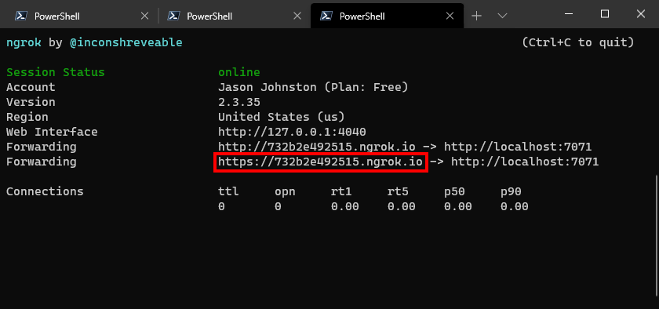

<!-- markdownlint-disable MD002 MD041 -->

In this exercise you will finish implementing the Web API Azure Function `GetMyNewestMessage` and the command-line test application that calls that API.

The Web API uses the [on-behalf-of flow](https://docs.microsoft.com/azure/active-directory/develop/v2-oauth2-on-behalf-of-flow). The basic order of events in this flow are:

- The test application uses an interactive auth flow to allow the user to sign in and grant consent. It gets back a token that is scoped to the Web API. The token does **NOT** contain any Microsoft Graph scopes.
- The test application invokes the Web API, sending its access token in the `Authorization` header.
- The Web API validates the token, then exchanges that token for a second access token that contains Microsoft Graph scopes.
- The Web API calls Microsoft Graph on the user's behalf using the second access token.

> [!IMPORTANT]
> To avoid storing the application ID and secret in source, you will use the [.NET Secret Manager](https://docs.microsoft.com/aspnet/core/security/app-secrets) to store these values. The Secret Manager is for development purposes only, production apps should use a trusted secret manager for storing secrets.

## Add authentication to the command-line application

Start by adding authentication to the command-line application. This will allow the application to get an access token granting access to call the Web API. Because this is a command-line application, it will use the [device code flow](https://docs.microsoft.com/azure/active-directory/develop/v2-oauth2-device-code).

1. Initialize the .NET development secret store by opening your CLI in the directory that contains **InvokeAzureFunctions.csproj** and running the following command.

    ```Shell
    dotnet user-secrets init
    ```

1. Add your application ID, tenant ID, and Web app ID to the secret store using the following commands. Replace `YOUR_TEST_APP_APP_ID_HERE` with the application ID you created in the Azure portal for the **Graph Azure Function Test App**. Replace `YOUR_TENANT_ID_HERE` with the **Directory (tenant) ID** value you copied from the Azure portal. Replace `YOUR_WEB_API_APP_ID_HERE` with the application ID for the **Graph Azure Function Web API**.

    ```Shell
    dotnet user-secrets set appId "YOUR_TEST_APP_APP_ID_HERE"
    dotnet user-secrets set tenantId "YOUR_TENANT_ID_HERE"
    dotnet user-secrets set webApiId "YOUR_WEB_API_APP_ID_HERE"
    ```

### Implement sign-in

In this section you will create an authentication provider that can be used with the Graph SDK and can also be used to explicitly request an access token by using the device code flow.

#### Create a device code authentication provider

1. Create a new directory in the **InvokeAzureFunctions** directory named **Authentication**.

1. Create a new file in the **Authentication** directory named **DeviceCodeAuthProvider.cs** and add the following code to that file.

    :::code language="csharp" source="../demo/InvokeAzureFunction/Authentication/DeviceCodeAuthProvider.cs" id="AuthProviderSnippet":::

### Sign in and display the access token

In this section you will update the application to call the `GetAccessToken` function, which will sign in the user. You will also add code to display the token.

1. Open the **./InvokeAzureFunction/Program.cs** file and add the following `using` statement to the top of the file.

    ```csharp
    using InvokeAzureFunction.Authentication;
    ```

1. Add the following function to the `Program` class.

    :::code language="csharp" source="../demo/InvokeAzureFunction/Program.cs" id="LoadAppSettingsSnippet":::

1. Add the following code to the `Main` function immediately after the `Console.WriteLine("Azure Function Graph Tutorial\n");` line.

    :::code language="csharp" source="../demo/InvokeAzureFunction/Program.cs" id="InitializationSnippet":::

1. Add the following code to the `Main` function immediately after the `// Display access token` line.

    ```csharp
    Console.WriteLine($"Access token: {accessToken}\n");
    ```

1. Build and run the app. When prompted for an ngrok URL, enter `http://loalhost`. The application displays a URL and device code.

    ```Shell
    PS C:\Source\InvokeAzureFunction> dotnet run
    Azure Function Graph Tutorial

    To sign in, use a web browser to open the page https://microsoft.com/devicelogin and enter the code F7CG945YZ to authenticate.
    ```

1. Open a browser and browse to the URL displayed. Enter the provided code and sign in. Once completed, return to the application to see the access token.

> [!TIP]
> You can parse the access token at [https://jwt.ms](https://jwt.ms) and confirm that the `aud` claim is the app ID for the Web API, and that the `scp` claim contains the Web API's permission scope, not Microsoft Graph.

## Add authentication to the Web API

In this section you'll implement the on-behalf-of flow in the `GetMyNewestMessage` Azure Function to get an access token compatible with Microsoft Graph.

1. Initialize the .NET development secret store by opening your CLI in the directory that contains **GraphTutorial.csproj** and running the following command.

    ```Shell
    dotnet user-secrets init
    ```

1. Add your application ID, secret, and tenant ID to the secret store using the following commands. Replace `YOUR_WEB_API_APP_ID_HERE` with the application ID for the **Graph Azure Function Web API**. Replace `YOUR_WEB_API_APP_SECRET_HERE` with the application secret you created in the Azure portal for the **Graph Azure Function Web API**. Replace `YOUR_TENANT_ID_HERE` with the **Directory (tenant) ID** value you copied from the Azure portal.

    ```Shell
    dotnet user-secrets set webApiId "YOUR_WEB_API_APP_ID_HERE"
    dotnet user-secrets set webApiSecret "YOUR_WEB_API_APP_SECRET_HERE"
    dotnet user-secrets set tenantId "YOUR_TENANT_ID_HERE"
    ```

1. Create a new file in the **GraphTutorial** directory named **Startup.cs** and add the following code to that file.

    :::code language="csharp" source="../demo/GraphTutorial/Startup.cs" id="StartupSnippet":::

### Create an on-behalf-of authentication provider

1. Create a new directory in the **GraphTutorial** directory named **Authentication**.

1. Create a new file in the **Authentication** directory named **OnBehalfOfAuthProvider.cs** and add the following code to that file.

    :::code language="csharp" source="../demo/GraphTutorial/Authentication/OnBehalfOfAuthProvider.cs" id="AuthProviderSnippet":::

### Implement GetMyNewestMessage function

1. Open **./GraphTutorial/GetMyNewestMessage.cs** and replace its entire contents with the following.

    :::code language="csharp" source="../demo/GraphTutorial/GetMyNewestMessage.cs" id="GetMyNewestMessageSnippet":::

## Call the Web API from the test app

1. Open **./InvokeAzureFunction/Program.cs** and replace the existing `GetNewestMessage` function with the following.

    :::code language="csharp" source="../demo/InvokeAzureFunction/Program.cs" id="GetNewestMessageSnippet":::

## Test the Web API

1. Change the current directory in your CLI to the **./GraphTutorial** directory and run the following command to start the Azure Function locally.

    ```Shell
    func start
    ```

1. Open a second CLI window and run ngrok with the following command.

    ```Shell
    ngrok http 7071
    ```

    Copy the **Forwarding** url that uses the HTTPS scheme.

    

1. Open a third CLI window and change the current directory to the **./InvokeAzureFunction** directory. Run the following command to run the test application.

    ```Shell
    dotnet run
    ```

1. When prompted for the ngrok URL, enter the value you copied from the ngrok output.

1. Follow the prompt to sign in to the test app. Once signed in, choose **1. Display the newest message in my inbox**. The app displays JSON output of the user's newest message.

> [!TIP]
> Since the test application is sending all requests to the Azure Function through ngrok, you can view the HTTP requests and responses by opening `http://localhost:4040` in your browser.
